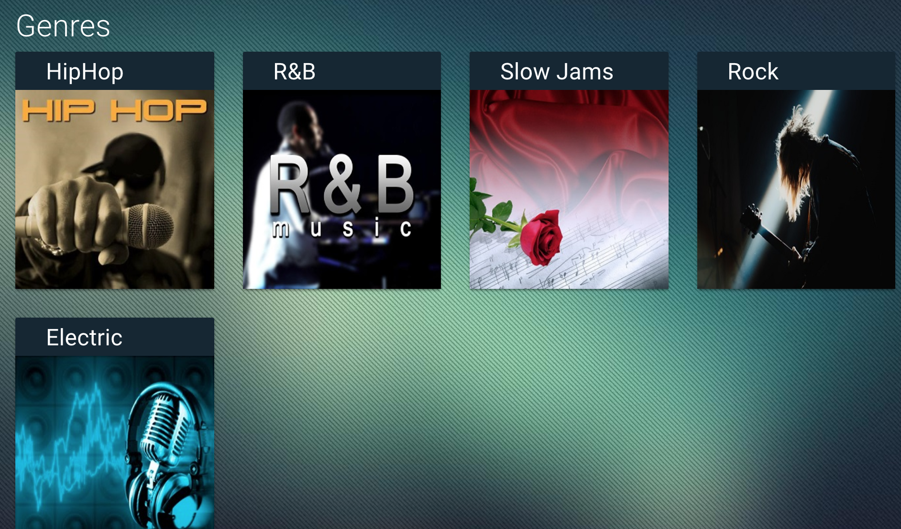

# Music streaming admin panel

It uses following API's of Open Age

- [Directory](http://open-age-docs.m-sas.com/blog/2018/05/03/employee-directory/)
- [Drive](http://open-age-docs.m-sas.com/blog/2018/07/27/docs/)

## Screenshots

## Technology

- Angular 5x
- OpenAge 1x
